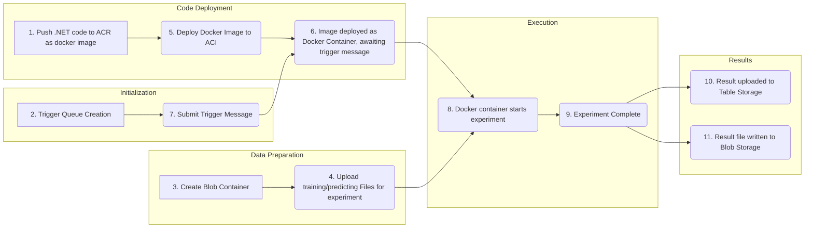

# ML22/23-12: Implement Anomaly Detection Sample - Azure Cloud Implementation

Implemented by Anurag De (1400450) - anurag.de@stud.fra-uas.de

# Introduction:

HTM (Hierarchical Temporal Memory) is a machine learning algorithm, which uses a hierarchical network of nodes to process time-series data in a distributed way. Each nodes, or columns, can be trained to learn, and recognize patterns in input data. This can be used in identifying anomalies/deviations from normal patterns. It is a promising approach for anomaly detection and prediction in a variety of applications. In our SE project in the winter semester, we used multisequencelearning class in NeoCortex API to implement an anomaly detection system, such that numerical sequences were read from multiple csv files inside a folder, trained our HTM Engine, and used the trained engine for learning patterns and detect anomalies.

I have refactored the project code so that it can be properly containerized and run in azure cloud, and implemented it in there successfully. 

# Project overview

The diagram given below gives us an overview of how the project runs in Azure cloud.



* Link to the SE project [readme](https://github.com/SouravPaulSumit/Team_anomaly/blob/master/mySEProject/AnomalyDetectionSample/README.md).
* Link to the SE project [code](https://github.com/SouravPaulSumit/Team_anomaly/tree/master/mySEProject/AnomalyDetectionSample) implemented in winter semester.
* Link to the [paper](https://github.com/SouravPaulSumit/Team_anomaly/blob/master/mySEProject/Documentation/updated_ML2223-12%20Implement%20Anomaly%20Detection%20Sample.pdf).
* Link to the project [code](https://github.com/UniversityOfAppliedSciencesFrankfurt/se-cloud-2022-2023/tree/Anurag_De/Source/MyCloudProjectSample) implemented in Azure cloud this semester.

# Description of the project

The names of the major components used in the experiment in cloud is given in the table below.

| Components | Name | Description |
| --- | --- | --- |
| [Resource Group](https://learn.microsoft.com/en-us/azure/azure-resource-manager/management/manage-resource-groups-portal#what-is-a-resource-group) | ```CCProjectR``` | --- |
| [Container Registry](https://learn.microsoft.com/en-us/azure/container-registry/container-registry-intro) | ```CCProjectC``` | --- |
| [Container Registry server](https://learn.microsoft.com/en-us/azure/container-registry/container-registry-intro) | ```ccprojectc.azurecr.io``` | --- |
| [Repository](https://learn.microsoft.com/en-us/azure/container-registry/container-registry-concepts) | ```adecloudproject:latest``` | Name of my repository |
| [Container Instance](https://learn.microsoft.com/en-us/azure/container-instances/container-instances-overview) | ```adecloudprojectcontainer``` | Name of the container instance where experiment runs |
| [Storage account](https://learn.microsoft.com/en-us/azure/storage/common/storage-account-overview) | ```ccprojectsd``` | --- |
| [Queue storage](https://learn.microsoft.com/en-us/azure/storage/queues/storage-queues-introduction) | ```ade-triggerqueue``` | Queue where trigger message is passed to initiate experiment|
| [Blob container](https://learn.microsoft.com/en-us/azure/storage/blobs/storage-blobs-introduction) | ```ade-trainingfiles``` | Training and prediction folders with csv files combined as zip and uploaded |
| [Blob container](https://learn.microsoft.com/en-us/azure/storage/blobs/storage-blobs-introduction) | ```ade-resultfiles``` | Used to store result csv written after completion of experiment |
| [Table storage](https://learn.microsoft.com/en-us/azure/storage/tables/table-storage-overview) | ```aderesultstable``` | Table used to store result of the experiment |

All the components are deployed in ***Germany West Central***.

Commands to pull my image from:

Azure container registry
```
docker pull ccprojectc.azurecr.io/adecloudproject:latest
````
Docker Hub
```
docker pull anuragdefuas/mycloudproject:latest
````

To start the experiment and run the cloud project, we will have to pass message in JSON format, similar to the one given below, to 'ade-triggerqueue' queue:

```json
{
    "ExperimentId": "ads00", ///Add you experiment ID
    "Name": "ML22/23-12",    
    "Description": "Implement Anomaly Detection Sample",
    "CombinedFolder": "mydataset_4.zip", ///Add the correct training zipfile name
    "RequestedBy": "Anurag", ///Add your name
    "ToleranceValue": 0.1 ///Add the tolerance value ratio 
}
 ```
This message will act as trigger to start the experiment.

Brief description of this message is given in the table below:

| JSON Key | Description |
|---------------------------------------|------------|
| ExperimentId | ExperimentID string for the experiment |
| Name | Name of the experiment |
| Description | Brief description of the experiment |
| CombinedFolder | Name of the zip file stored in storage container; will be used for experiment |
| RequestedBy | Name of the requester |
| ToleranceValue | Tolerance value (ratio) for the experiment |

The zip file, which contains our training and predicting folders should be uploaded to blob storage container 'ade-trainingfiles' before the experiment is started. It will be used in our experiment.

Some training files are already kept in the container. Please note that the file **"mydataset_2.zip"** can we used for trial cloud experiment (contains a small dataset, takes around 20-25 mins). Rest of the files take a longer time for HTM training. Numbers in the name of the zip files signify the number of sequences that are used for training.


The name of the zip file used for the experiment should be provided in the input JSON message. The folder structure inside the zip file ***must*** be in the following format.


The requestor should provide the JSON message to the 'ade-triggerqueue' queue like this (Please uncheck the box which asks to encode the message body in Base64): 


Once this is done, our experiment starts in the container instance 'adecloudprojectcontainer' (4-core, 10 GB memory), which has already been deployed in azure container instances.


The container instance was deployed from azure container registry, where the containerized (dockerized) project code had already been pushed earlier from my local machine.


Once our experiment is complete, it should look something like this, 


Th results from our experiment are written to our table 'aderesultstable':


The text output file from our experiment is uploaded to blob storage container 'ade-resultfiles'.


Just like my previous project (SE), the project code for running our experiment in cloud uses [MultiSequenceLearning](https://github.com/ddobric/neocortexapi/blob/master/source/Samples/NeoCortexApiSample/MultisequenceLearning.cs) class in NeoCortex API for training our HTM Engine as it's base, so the algorithm remains mostly the same. I have made changes to the earlier code so that the code can be properly containerized for running in cloud.  The most significant changes made are:

* Added new class to store new experiment result metrics for writing to results table.

```csharp
    public static class StoredOutputValues
    {
        public static double TrainingTimeInSeconds { get; set; }
        public static string OutputPath { get; set; }
        public static double totalAvgAccuracy { get; set; }
    }
```

* Modified RunExperiment so that it accepts the training/ predicting folder paths, and tolerance values as parameters.

```diff
public class myExperiment
{
   public static void Main()
   {
        HTMAnomalyTesting anomalydetect = new HTMAnomalyTesting();
-       anomalydetect.RunExperiment();
+       anomalydetect.RunExperiment(tValue, inputTrainingFolder, inputPredictingFolder);
   }
}
```

* Added file writing capability in addition to earlier code. 


  
The results table contain the following parameters:

| Parameter | Description |
|---------------------------------------|------------|
| PartitionKey | Defines the logical partition within a table |
| RowKey | Helps in unique identification of an entity |
| Timestamp | Timestamp of the experiment |
| Description | Small description of the experiment |
| DurationSec | Description of the experiment |
| StartTimeUtc | Start time of the experiment |
| EndTimeUtc | End time of the experiment |
| ExperimentId | Experiment ID of the experiment, given by user |
| Name | Name of the requester |
| OutputFileUrl | Path of the output CSV file |
| TrainingFolderUrl | Path of the training folder |
| PredictingFolderUrl | Path of the predicting folder |
| RequestedBy | Name of the requestor |
| ToleranceValue | Double value of the tolerance ratio |
| AvgAccuracy | Accuracy of our trained HTM engine in anomaly detection |

Brief description about some important C# methods for the cloud project:

* [DownloadCombinedFolders()](https://github.com/UniversityOfAppliedSciencesFrankfurt/se-cloud-2022-2023/blob/6be0d87b667c2ea8b1257e27dac27d516641db10/Source/MyCloudProjectSample/MyExperiment/AzureStorageProvider.cs#L26) method is used for downloading the zip file needed for the experiment to the application's base path, and then returns the paths to the extracted training and predicting folders as an array.

```csharp

public async Task<string[]> DownloadCombinedFolders(string fileName)
        {
            BlobContainerClient container = new BlobContainerClient(this.config.StorageConnectionString, config.TrainingContainer);
            ............
            ZipFile.ExtractToDirectory(downloadedFilePath, basePath, true);
            ............
            ............
            return new string[] { extractedTrainingFolderPath, extractedPredictingFolderPath };
            ............

        }               
   
```

* [UploadExperimentResult()](https://github.com/UniversityOfAppliedSciencesFrankfurt/se-cloud-2022-2023/blob/6be0d87b667c2ea8b1257e27dac27d516641db10/Source/MyCloudProjectSample/MyExperiment/AzureStorageProvider.cs#L81) and [UploadResultFile()](https://github.com/UniversityOfAppliedSciencesFrankfurt/se-cloud-2022-2023/blob/6be0d87b667c2ea8b1257e27dac27d516641db10/Source/MyCloudProjectSample/MyExperiment/AzureStorageProvider.cs#L105) methods upload the experiment result to table - 'aderesultstable' and blob container - 'ade-resultfiles' respectively.
* [Run()](https://github.com/UniversityOfAppliedSciencesFrankfurt/se-cloud-2022-2023/blob/6be0d87b667c2ea8b1257e27dac27d516641db10/Source/MyCloudProjectSample/MyExperiment/Experiment.cs#L32) method runs the main refactored SE code(Experiment). We then use an instance of [ExperimentResult](https://github.com/UniversityOfAppliedSciencesFrankfurt/se-cloud-2022-2023/blob/Anurag_De/Source/MyCloudProjectSample/MyCloudProject.Common/ExperimentResult.cs) class to store our result.
* [RunQueueListener()](https://github.com/UniversityOfAppliedSciencesFrankfurt/se-cloud-2022-2023/blob/6be0d87b667c2ea8b1257e27dac27d516641db10/Source/MyCloudProjectSample/MyExperiment/Experiment.cs#L58) waits for a trigger message, and runs the whole experiment sequentially after trigger message is received.

